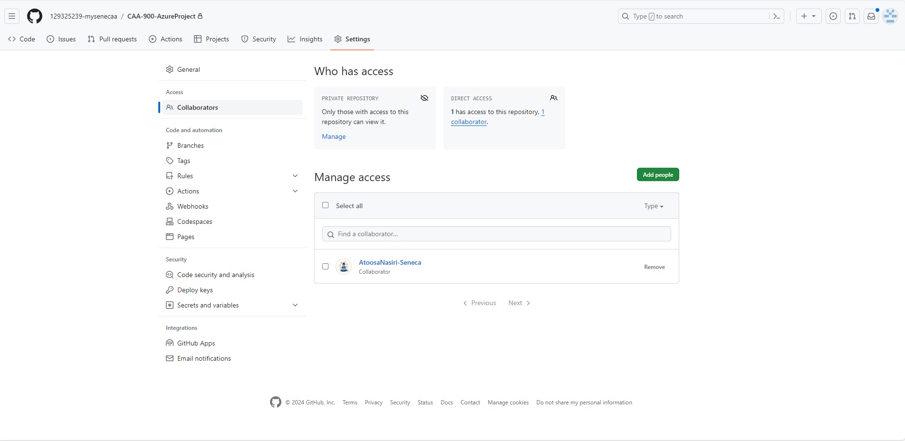

# CAA-900-AzureProject


# Checkpoint1 Submission

- **COURSE INFORMATION: xxx**
- **STUDENT’S NAME: Isaiah Cyrus Majam**
- **STUDENT'S NUMBER: 129325239**
- **GITHUB USER_ID: 129325239-mysenecaa**
- **TEACHER’S NAME: Atoosa Nasiri**

## Table of Contents
 - [An image](#my-collaboration-image)
 - [Single Line Code Snippet](#my-single-line-of-code)
 - [Multi line code snippet (preferably bash script)](#my-multiple-lines-of-code)
 - [sample .json objects](#sample-json-code)
 - [sample table](#sample-table)
 - [sample hyperlink](#sample-hyperlink)

### My Collaboration Image


### My Single line of code

In mark-down if you want to embed a code in text, use single back quotes like `sudo apy-get update`


### My Multiple lines of code

In mark-down we embed multiple lines of code using triple back quotes

```bash
   sudo yum install -y yum-utils
   sudo yum-config-manager --add-repo https://rpm.releases.hashicorp.com/AmazonLinux/hashicorp.repo
   sudo yum -y install terraform
```

### Sample .json code
```json
{
    "glossary": {
        "title": "example glossary",
		"GlossDiv": {
            "title": "S",
			"GlossList": {
                "GlossEntry": {
                    "ID": "SGML",
					"SortAs": "SGML",
					"GlossTerm": "Standard Generalized Markup Language",
					"Acronym": "SGML",
					"Abbrev": "ISO 8879:1986",
					"GlossDef": {
                        "para": "A meta-markup language, used to create markup languages such as DocBook.",
						"GlossSeeAlso": ["GML", "XML"]
                    },
					"GlossSee": "markup"
                }
            }
        }
    }
}
```

### Sample Table


| Default    | Left align | Center align | Right align |
| ---------- | :--------- | :----------: | ----------: |
| 9999999999 | 9999999999 | 9999999999   | 9999999999  |
| 999999999  | 999999999  | 999999999    | 999999999   |
| 99999999   | 99999999   | 99999999     | 99999999    |
| 9999999    | 9999999    | 9999999      | 9999999     |

| Date | Event Name |
| - | - |
| Nov. 8, 2023 |	New students (domestic) — Winter 2024 Term tuition deposit due |
| Nov. 8, 2023 |	Returning students — Winter 2024 Term: tuition deposit due for 2023/2024 academic year (tuition deposit is due once per academic year) |
| Dec. 1, 2023 |	Last day to submit requests for transfer credit for Winter 2024 Term |
| Dec. 6, 2023 |	Open enrolment begins for Winter 2024 Term on Student Home |

<table>
<tr>
<th>Heading 1</th>
<th>Heading 2</th>
</tr>
<tr>

<td>

| A | B | C |
|--|--|--|
| 1 | 2 | 3 |

</td><td>

| A | B | C |
|--|--|--|
| 1 | 2 | 3 |

<pre lang="js">
console.log(fullName); // undefined
fullName = "Dariana Trahan";
console.log(fullName); // Dariana Trahan
var fullName;
</pre>

</td></tr> </table>


### Sample hyperlink

- [The Ultimate Markdown Cheat Sheet](https://towardsdatascience.com/the-ultimate-markdown-cheat-sheet-3d3976b31a0)


