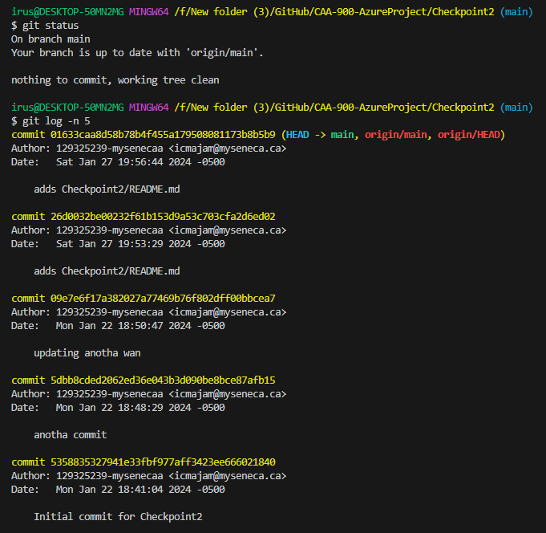

# CAA-900-AzureProject

# Checkpoint2 Submission

- **COURSE INFORMATION: CAA900ZAA**
- **STUDENT’S NAME: Isaiah Cyrus Majam**
- **STUDENT'S NUMBER: 129325239**
- **GITHUB USER_ID: 129325239-mysenecaa**
- **TEACHER’S NAME: Atoosa Nasiri**

THE GIT PROCESS IS 
 
git status  
git add .  
git commit  
git push  
git status  

## Table of Contents
1. [Part A - Adding Files - Local Repo Workflow](#header1)
2. [Part B - Inspecting Local Repo with `git status` and `git log`](#header2)
3. [Part C - Creating & Merging Branches](#header3)
4. [Part D - Git Branching Strategy Review Question](#header4)

### Part A - Adding Files - Local Repo Workflow

- [git_status_untracked](https://github.com/129325239-mysenecaa/CAA-900-AzureProject/blob/main/Checkpoint2/git_status_untracked.txt)
- [git_status_uncommitted](https://github.com/129325239-mysenecaa/CAA-900-AzureProject/blob/main/Checkpoint2/git_status_uncommitted.txt)
- [git_status_committed](https://github.com/129325239-mysenecaa/CAA-900-AzureProject/blob/main/Checkpoint2/git_status_committed.txt)
- 
