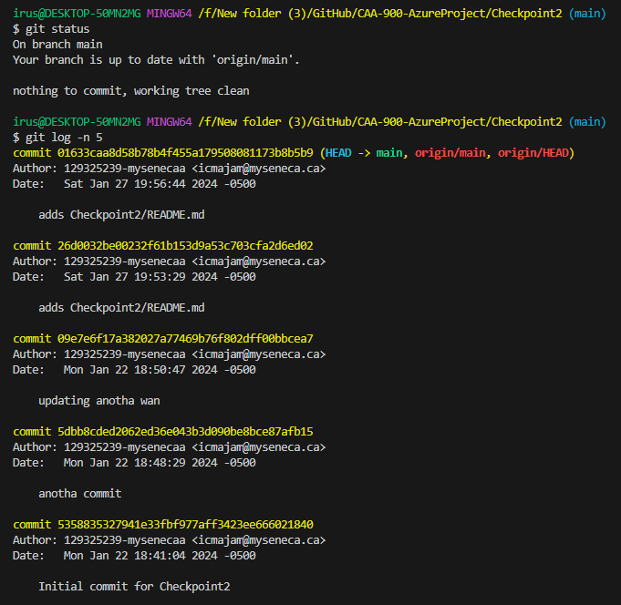
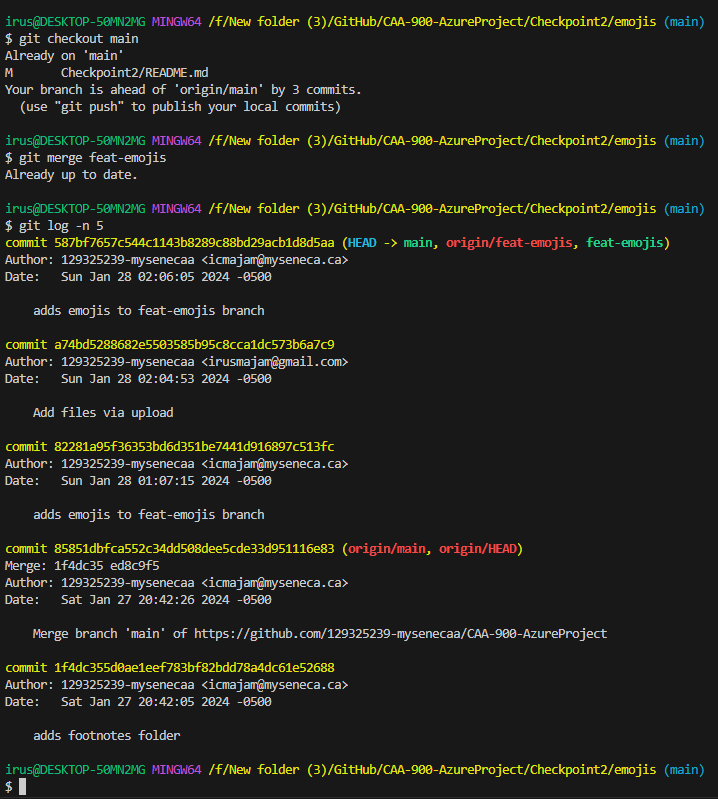

# CAA-900-AzureProject

# Checkpoint2 Submission

- **COURSE INFORMATION: CAA900ZAA**
- **STUDENT’S NAME: Isaiah Cyrus Majam**
- **STUDENT'S NUMBER: 129325239**
- **GITHUB USER_ID: 129325239-mysenecaa**
- **TEACHER’S NAME: Atoosa Nasiri**

THE GIT PROCESS IS 
 
git status  
git add .  
git commit  
git push  
git status  

## Table of Contents
1. [Part A - Adding Files - Local Repo Workflow](#Part-A---Adding-Files---Local-Repo-Workflow)
2. [Part B - Inspecting Local Repo with `git status` and `git log`](#Part-B---Inspecting-Local-Repo-with-`git-status`-and-`git-log`)
3. [Part C - Creating & Merging Branches](#Part-C---Creating-&-Merging-Branches)
4. [Part D - Git Branching Strategy Review Question](#Part-D---Git-Branching-Strategy-Review-Question)

### Part A - Adding Files - Local Repo Workflow

- [git_status_untracked](https://github.com/129325239-mysenecaa/CAA-900-AzureProject/blob/main/Checkpoint2/git_status_untracked.txt)
- [git_status_uncommitted](https://github.com/129325239-mysenecaa/CAA-900-AzureProject/blob/main/Checkpoint2/git_status_uncommitted.txt)
- [git_status_committed](https://github.com/129325239-mysenecaa/CAA-900-AzureProject/blob/main/Checkpoint2/git_status_committed.txt)
- "Everything is up to date"  

### Part B - Inspecting Local Repo with `git status` and `git log`
- The difference between `git status` and `git log` is that `git status` shows the information about the current state of the working directory and statging area while `git log` shows the commit history

### Part C - Creating & Merging Branches
- "Merging over here"  

### Part D - Git Branching Strategy Review Question
- What are the differences between develop branch and main branch?
    - The develop branch is the branch that has all the latest state of code used for development and the main branch is the latest code used in production environment that is basically only accepting the live and documented releases
- What are the three supporting branches? Briefly describe the function of each of these supporting branches.
    - Feature branches - Used when developing new features 
    - Hotfix branches - Used when to work on fixes on the code
    - Release branches - Used as a landing dock for features and hotfix branches when they are about to be used for production releases
- What are the best practices in working with release branches?
    - To have it segmented in versions, to have a breanch dedicated to bug fixes and testing, tagging necessary details per commit and a always merging the main and developing release branches regularly