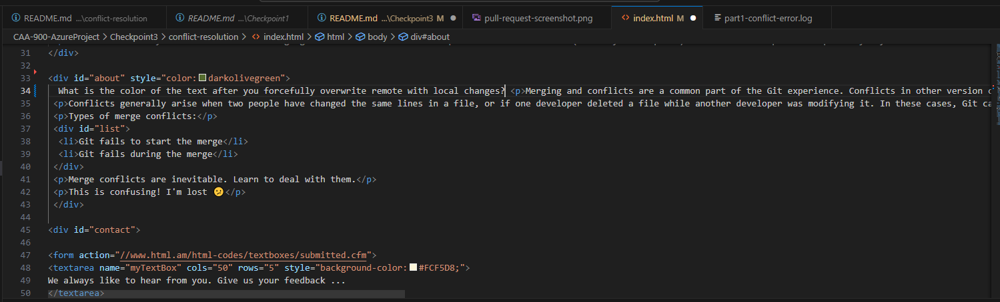
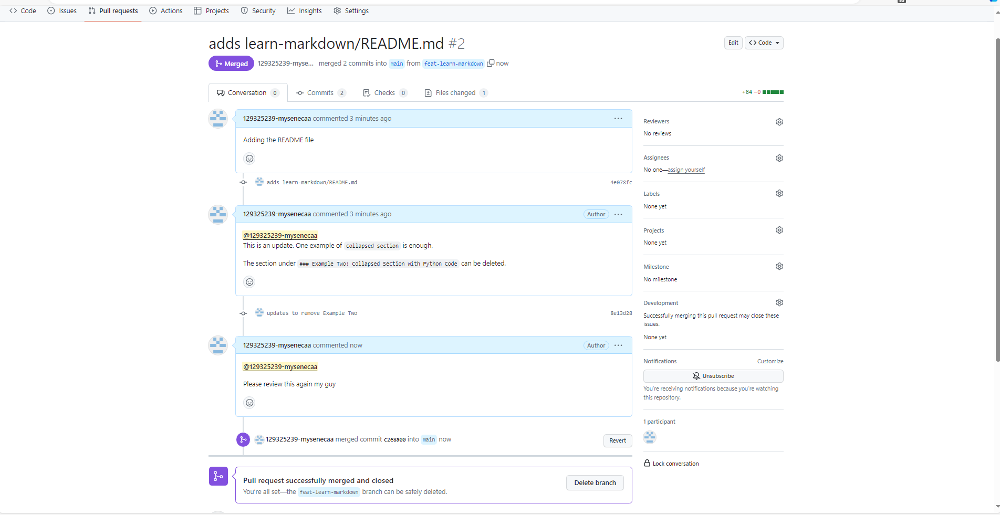

# CAA-900-AzureProject


# Checkpoint3 Submission

- **COURSE INFORMATION: CAA900ZAA**
- **STUDENT’S NAME: Isaiah Cyrus Majam**
- **STUDENT'S NUMBER: 129325239**
- **GITHUB USER_ID: 129325239-mysenecaa**
- **TEACHER’S NAME: Atoosa Nasiri**


## Table of Contents
1. [Part A - Manage Conflicts - Overwrite Remote Changes](#Part-A---Manage-Conflicts---Overwrite-Remote-Changes)
2. [Part B - Manage Conflicts - Reset Local Commit Head](#Part-B---Manage-Conflicts---Reset-Local-Commit-Head)
3. [Part C - Manage Conflicts - Merge Editor](#Part-C---Manage-Conflicts---Merg-Editor)
4. [Part D - Collaboration - Creating Pull Request](#Part-D---Collaboration---Creating-Pull-Request)


### Part A - Manage Conflicts - Overwrite Remote Changes

part1-conflict-error.log
```log
Pushing to https://github.com/129325239-mysenecaa/CAA-900-AzureProject.git
To https://github.com/129325239-mysenecaa/CAA-900-AzureProject.git
 ! [rejected]        main -> main (fetch first)
error: failed to push some refs to 'https://github.com/129325239-mysenecaa/CAA-900-AzureProject.git'
hint: Updates were rejected because the remote contains work that you do not
hint: have locally. This is usually caused by another repository pushing to
hint: the same ref. If you want to integrate the remote changes, use
hint: 'git pull' before pushing again.
hint: See the 'Note about fast-forwards' in 'git push --help' for details.
```

part1-conflict-overwrite.log
```log
POST git-receive-pack (6931 bytes)
Pushing to https://github.com/129325239-mysenecaa/CAA-900-AzureProject.git
To https://github.com/129325239-mysenecaa/CAA-900-AzureProject.git
 + e3f6734...62cc2ba main -> main (forced update)
updating local tracking ref 'refs/remotes/origin/main'
```

What is the color of the text after you forcefully overwrite remote with local changes?
- The color is _**darkolivegreen**_


### Part B - Manage Conflicts - Reset Local Commit Head

part2-conflict-error.log
```log
Pushing to https://github.com/129325239-mysenecaa/CAA-900-AzureProject.git
To https://github.com/129325239-mysenecaa/CAA-900-AzureProject.git
 ! [rejected]        main -> main (fetch first)
error: failed to push some refs to 'https://github.com/129325239-mysenecaa/CAA-900-AzureProject.git'
hint: Updates were rejected because the remote contains work that you do not
hint: have locally. This is usually caused by another repository pushing to
hint: the same ref. If you want to integrate the remote changes, use
hint: 'git pull' before pushing again.
hint: See the 'Note about fast-forwards' in 'git push --help' for details.
```

part2-pull-error.log
```log
POST git-upload-pack (196 bytes)
POST git-upload-pack (483 bytes)
From https://github.com/129325239-mysenecaa/CAA-900-AzureProject
   950a4b7..4ef9845  main        -> origin/main
 = [up to date]      dummy       -> origin/dummy
 = [up to date]      feat-emojis -> origin/feat-emojis
Updating 950a4b7..4ef9845
Fast-forward
 Checkpoint3/conflict-resolution/index.html | 4 ++--
 1 file changed, 2 insertions(+), 2 deletions(-)
```

part2-reset-head.log
```log
HEAD is now at 950a4b7 cp3-part1 update
```

part2-pull-success.log
```log
POST git-upload-pack (196 bytes)
From https://github.com/129325239-mysenecaa/CAA-900-AzureProject
 = [up to date]      main        -> origin/main
 = [up to date]      dummy       -> origin/dummy
 = [up to date]      feat-emojis -> origin/feat-emojis
error: Your local changes to the following files would be overwritten by merge:
	Checkpoint3/conflict-resolution/index.html
Please commit your changes or stash them before you merge.
Updating 950a4b7..4ef9845
Aborting
```

What is the color of the text after you forcefully overwrite remote with local changes?
-  The color is _**green**_
-  
### Part C - Manage Conflicts - Merge Editor
part3-pull-conflict.log
```log
POST git-upload-pack (375 bytes)
From https://github.com/129325239-mysenecaa/CAA-900-AzureProject
 * branch            feat-body-text -> FETCH_HEAD
 = [up to date]      feat-body-text -> origin/feat-body-text
Auto-merging Checkpoint3/conflict-resolution/index.html
CONFLICT (content): Merge conflict in Checkpoint3/conflict-resolution/index.html
Automatic merge failed; fix conflicts and then commit the result.

```

part3-status.log
```log
On branch main
Your branch is up to date with 'origin/main'.

All conflicts fixed but you are still merging.
  (use "git commit" to conclude merge)

Changes to be committed:
	modified:   Checkpoint3/conflict-resolution/index.html

Changes not staged for commit:
  (use "git add <file>..." to update what will be committed)
  (use "git restore <file>..." to discard changes in working directory)
	modified:   Checkpoint3/README.md

```


###  Part D - Collaboration - Creating Pull Request


