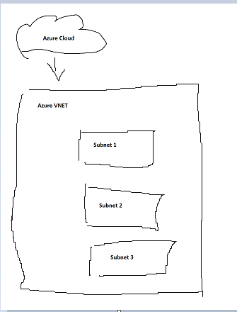
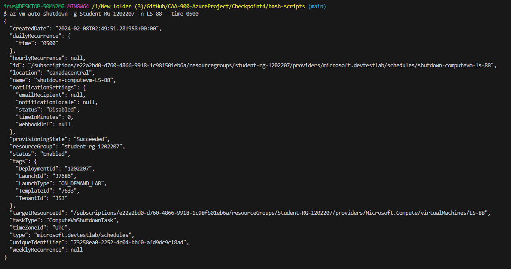

# CAA-900-AzureProject


# Checkpoint4 Submission

- **COURSE INFORMATION: CAA900ZAA**
- **STUDENT’S NAME: Isaiah Cyrus Majam**
- **STUDENT'S NUMBER: 129325239**
- **GITHUB USER_ID: 129325239-mysenecaa**
- **TEACHER’S NAME: Atoosa Nasiri**


## Table of Contents

1. [Part A - Creating Network Resources using Azure CLI](#part-a---creating-network-resources-using-azure-cli)
2. [Part B - Working with Azure CLI Bash](#part-b---working-with-azure-cli-bash)
3. [Part C - Network Review Questions](#part-c---network-review-questions)
4. [Part D - Creating Virtual Machines](#part-d---creating-virtual-machines)
5. [Part E - Creating Custom Images](#part-e---creating-custom-images)
6. [Part F - Clean Up your Environment](#part-f---clean-up-your-environment)

### Part A - Creating Network Resources using Azure CLI

```
# //////////////////////////////////////////////////////////////
# Update the lines that are specific to your network 
# /////////////////////////////////////////////////////////////

RG_NAME="Student-RG-1202207"     # your student group
LOCATION="canadacentral"    # your location
ID="88"          #unique ID assigned to you

Student_vnet_name="Student-1202207-vnet"
Student_vnet_address="10.13.175.0/24"
Client_Subnet_name="Virtual-Desktop-Client"
Client_Subnet_address="10.13.175.0/24"
```

Answer below questions:

- In network_config_test.sh what does if [[ ! $(az group list -o tsv --query "[?name=='$RG_NAME']") ]] do? Explain your answer.

-- This command will check the list of resources in the Azure accounts Resource groups and checks if it is equal to resource name from the network_config.sh    

- Why is it crucial to check if a resource exist before creating it? What bash syntax do you use to test this? How do you check if a vnet exists in vnet_create.sh?

-- It is better to check if a resource is existing before creating it so that it would not be a waste of resources when they could just be re-used and modified which can result into loss of data, unnecassry consumption, and conflicting operations. To check if a vnet exists in the vnet_create.sh it is used in the following syntax:
`if [[ $(az network vnet list -g $RG_NAME -o tsv --query "[?name=='$vnet']") ]]`

- What is the Azure CLI command to create vnet? Give the specific command as per your environment and unique ID configuration. What are the required and what are the optional parameters that you need to pass to it?

Azure CLI Command:
`az network vnet create`    
Specific Command per my environment and unique ID configuration:

```bash
az network vnet create -g $RG_NAME \
            --name $vnet \
            --location $LOCATION \
            --address-prefix $address_prefix
```

Required Parameters:

```bash
--name
--resource-group
```

Optional Parameters:
```bash
--address-prefixes
--subnet-name
--subnet-prefix
--location
--dns-servers
--ddos-protection-plan
--vm-protection-enabled
--vm-protection-mappings
```

- What is the Azure CLI command to create subnet? Give the specific command as per your environment and unique ID configuration.    

Azure CLI Command:
`az network vnet subnet create`

Specific Command per my environment and unique ID configuration:
```bash
az network vnet subnet create --name $subnet_name \
                        -g $RG_NAME \
                        --vnet-name $vnet \
                        --address-prefix $address_prefix
```

Required Parameters:

```bash
--name
--vnet-name
--resource-group
```

Optional Parameters:
```bash
--address-prefix
--network-security-group
--route-table
--delegations
--service-endpoints
--private-endpoint-network-policies
--disable-private-link-service-network-policies
--nat-gateway
--disable-dns-registration
```


### [Part B - Working with Azure CLI Bash](#header2)

1. List all VNETs using `az network vnet list` command and send the output in `json` format to `vnet_list.json`file

    [vnet_list.json](./vnet_list.json)

2. Get the details of your `default student vnet` using `az show` command and send the output in `json` format to `student_vnet.json` file  

    [student_vnet.json](./student_vnet.json)

3. List all peerings using `az network vnet peering list` command and send the output in `table` format to `peerings.tbl`file

    [peerings.tbl](./peerings.tbl)

```
AllowForwardedTraffic    AllowGatewayTransit    AllowVirtualNetworkAccess    DoNotVerifyRemoteGateways    Name            PeeringState    PeeringSyncLevel    ProvisioningState    ResourceGroup       ResourceGuid                          UseRemoteGateways
-----------------------  ---------------------  ---------------------------  ---------------------------  --------------  --------------  ------------------  -------------------  ------------------  ------------------------------------  -------------------
True                     False                  True                         False                        ServertoRouter  Connected       FullyInSync         Succeeded            Student-RG-1202207  75d3058a-8274-0242-32d2-66afbd3d7835  False

```

4. Get the details of your `Router-XX` subnet `SN1` using `az show` command in `json` format and `query` it for details of subnet and rout associations. Only submit 
the specific property you are asked for. You will need to embed this in your `README.md` as per instructions.

```json
{
  "AddressPrefix": "192.168.88.32/27",
  "Associations": null,
  "Subnet": "SN1"
}
```

5. List all routes in `RT-xx` using `az network route-table route list` command and send the output in `table` format to `route_list.tbl`file

      [route_list.tbl](./route_list.tbl)

```
AddressPrefix    HasBgpOverride    Name              NextHopIpAddress    NextHopType       ProvisioningState    ResourceGroup
---------------  ----------------  ----------------  ------------------  ----------------  -------------------  ------------------
172.17.88.32/27  False             Route-to-Server   192.168.88.36       VirtualAppliance  Succeeded            Student-RG-1202207
10.13.175.0/24   False             Route-to-Desktop  192.168.88.36       VirtualAppliance  Succeeded            Student-RG-1202207

```

6. Get the details of route between your `Router-xx SN1` and `Server-xx SN` using `az network route-table route show` and send the output in `json` format to `route_details.json`

      [route_details.json](./route_details.json)


7. (Optional) What CLI command will show you which subnet is associated to which route in route table? _(Hint: maybe start with 'az network vnet subnet show`)_

`az network route-table route list`


### [Part C - Network Review Questions](#header3)

1. What is Azure Virtual Network (VNET)? Elaborate in your own words, you may use diagrams if drawn by yourself.
    - The Azure Virtual Network (VNET) is basically a space allocated in the Azure cloud platform where you can setup different resources depending on what a user needs when doing any infrastructure building in the internet. This can range from making virtual machines, apps, subnets, security groups and more.  
    
2. In the context of Hybrid Cloud architecture. How on-prem computers can access resources inside Azure virtual network?
    - An on-prem network of computers in a Hybrid Cloud architecture can access resources inside an Azure virtual network is though an Azure Virtual Network Gateway (VPN) which are done usually in two methods, Site-to-Site, which involves setting up a VPN connection between the on-prem network and the Azure VNET, and a ExpressRoute which is almost the same thing as a Site-to-Site but is for higher performance and a more dedicated connection through private means.
3. What are the most important benefits of Azure Virtual Networks? Elaborate in your own words. Do not copy/paste from Azure Documentation. Itemized list of just benefit without proper elaboration will not receive any marks
    - Environment isolation for applicaitons - this allows users to create unique and organized environments for different applications or organizational units.
    - Subnetting feature - This helps organizations organize their inner network and databases in the company to keep things orderly and easy to manage.
    - Traffic direction - An Azure Virtual Network comes with Azure Load Balancer which is a service that can help distribute incoming network traffic across multiple VM's to ensure high availability on a users applications.
    - Secure network - Network Security gorups are provided by allowing users to define rules that control inbound and outbound traffice to and from resoruces within a virtual network.
    - Dynamic Scaling - Virtual Networks can dynamically scale to accomodate the growth demands of applications and/or services if needed.
4. What is the difference between Network Security Group (NSG) and Route-Tables?
    - An NSG is primarily used in controlling the inbound and outbound traffic in a network, VM and subnets that allows or denies traffic based on rules defined by a user. While a Route Table on the other hand is used to control the routing of network traffic within a network and determines the where the traffic should be directed to based on the IP address.
5. What is the difference between NSG and Firewalls?
    - An NSG is the service or feature in Azure that controls the inbound and outbound traffic of a network while a Firewall is tool used along with NSG as another layer of security in a network.
6. What is a _hob-and-spoke_ network topology and how be deployed in Azure Cloud?
    - It is a network topology design where there is a central "hub" network that is connected to multiple "spoke" networks. The hub serves as a central meeting point of all spokes and spokes are nodes connected to a hub but not directly connected to other spokes.
7. In working with Azure VNETs, do you need to define gateways for Azure to route traffic between subnets?
    - The need for defining gatewats are dependant on the business need required to commuinicate between subnets within the same VNET or with other VNETS. When communicating with subnets within the same VNET, we dont need to setup gateways but if we need to communicate with other VNETS then we would need a gateway to route traffice appropritately between subnets.
8. When do you need to configure and use Virtual Network Gateways?
    - We usually need to configure and use Virtual Network Gateways when we need to enable a secure connection between different networks and depending on the network architecture of the VNET. Using Virtual Network Gateways provide securre tunnels and encryptions needed for data to flow between different network environments.

### [Part D - Creating Virtual Machines](#header4)

1. List all VMs and send the output in `table` format to `vm_list.tbl` file. What command did you use?

    - The command used is `az vm list --out table > vm_list.tbl`

    ```tbl
    Name    ResourceGroup       Location       Zones
    ------  ------------------  -------------  -------
    LR-88   STUDENT-RG-1202207  canadacentral
    LS-88   STUDENT-RG-1202207  canadacentral
    WC-88   STUDENT-RG-1202207  canadacentral
    WS-88   STUDENT-RG-1202207  canadacentral
    ```

2. Get the details of your `WC-88` using `az show` command and send the output in `json` format to `WC-88-details.json` file. What command did you use?

    - The command used is `az vm show --name WC-88 --resource-group Student-RG-1202207 --out json > WC-88-details.json`

    [WC-88-details.json](./WC-88-details.json)


3. List all NSG using `az list` command and send the output in `table` format to `nsg_list.tbl`file. What command did you use?

    - The command used is `az network nsg list --out table > nsg_list.tbl`

    ```
    Location       Name       ProvisioningState    ResourceGroup       ResourceGuid
    -------------  ---------  -------------------  ------------------  ------------------------------------
    canadacentral  LR-NSG-88  Succeeded            Student-RG-1202207  674e06ca-8977-4744-afa0-64e1aabc7856
    canadacentral  LS-NSG-88  Succeeded            Student-RG-1202207  2bf0d40b-c9eb-4596-8802-ebb99a70c9f6
    canadacentral  WC-NSG-88  Succeeded            Student-RG-1202207  bc551180-4278-45ff-a027-48a53a190148
    canadacentral  WS-NSG-88  Succeeded            Student-RG-1202207  849f7b78-51fd-4671-a6a3-b9c32dbeaa9a
    ```
4. Provide screenshot of _auto shutdown configuration_ for `LS_XX`. Is there any command to show this? What is the time-zone? What should be the correct time settings considering the time zone differences?

    - The command to show the auto-shutdown-configuration is `az vm auto-shutdown -g Student-RG-1202207 -n LS-88 --time 0500`.
    - The auto-shutdown uses the UTC timezone.
    - The time setting we use is "0500" which will configure: 12:00 midnight EST
    


5. Why `auto shutdown configuration` is not done in [vm_create](https://github.com/Azure-Project-Winter2024/Azure-Project-Scripts/blob/94d21ad5454163ae8e2ee331f8a41291fca6e155/CP4-Scripts/bash-scripts/vm_create.sh#L128) code? Why is it a separate scripts? Is it possible to configure auto shutdown at the same time you are creating the VM?
    - The `auto shutdown configuration` is done in the `vm_create.sh` script and is also in a separate script. It is also possible to configure the auto shutdown and VM creation code in the same script but the `auto shutdown configuration` script needs a wait time while the VM's are being created before it can be executed.


### [Part E - Creating Custom Images](#Header5)

1. What are the difference between the script that creates VM from Azure Generic Image vs Custom Image? A good place to start is to compare the two scripts `custom_vm_create.sh` and `vm_create.sh` and check the parameters passed to `az vm create` command. Elaborate the differences you observe.

    - The main difference between the twos scripts is the presence of the `--security-type Standard` parameter. I had to include this line in the vm_create.sh script so that when the VM is created and we create an image of that VM in custom_vm_create.sh script, it would fix the security warning which was a cause in weather or not Azure would create a VM from the image or not. Another difference is the paramater `--hyperv-generation` that is present in the custom_vm_create.sh script and not in the vm_create.sh script. This parameter is used for Windows VMs to specify whether Azure should create the VM as a Gen1 or Gen2 VM.

2. If you run `custom_vm_create.sh` without custom image `version` number, the script will throw an error and show you the usage suggestion. What is the usage suggestion?

    ```
    "target_version parameter not provided"
    "Usage: ./image_create.sh <target_version>"
    ```

3. The script is purposefully written such that it waits on each custom image creation to be completed before proceeding to next image. Can you update the script such that custom images creation runs in background, i.e. how can you parallelize the process?_Hint: only provide the single line command that you need to update_

    `sleep 10`

4. Once all custom images are successfully created, run a command in CLI that lists all your Custom Images. Change the output format to table format and embed the answer in your submission.

    ```
    HyperVGeneration    Location       Name           ProvisioningState    ResourceGroup
    ------------------  -------------  -------------  -------------------  ------------------
    V2                  canadacentral  lr-88-ver-1.0  Succeeded            STUDENT-RG-1202207
    V2                  canadacentral  ls-88-ver-1.0  Succeeded            STUDENT-RG-1202207
    V2                  canadacentral  wc-88-ver-1.0  Succeeded            STUDENT-RG-1202207
    V1                  canadacentral  ws-88-ver-1.0  Succeeded            STUDENT-RG-1202207
    ```

5. Delete your VMs using the proper script after above step is completed. Then re-create VMs using your custom images. Check is all VMs are accessible, i.e. Client VM can be reached via Bastion and Linux VMs can be accessed with ssh.

6. Get a list of your VM, NSG, NIC, Disks, and Custom Iamges using Azure CLI in table format. Which ones are empty? **Do not include screenshots, just embed the output in **table** format in your submission.

 - List of VMs
    ```tbl
    Name    ResourceGroup       Location       Zones
    ------  ------------------  -------------  -------
    LR-88   STUDENT-RG-1202207  canadacentral
    LS-88   STUDENT-RG-1202207  canadacentral
    WC-88   STUDENT-RG-1202207  canadacentral
    WS-88   STUDENT-RG-1202207  canadacentral
    ```

 - List of NSGs
    ```tbl
    Location       Name       ProvisioningState    ResourceGroup       ResourceGuid
    -------------  ---------  -------------------  ------------------  ------------------------------------
    canadacentral  LR-NSG-88  Succeeded            Student-RG-1202207  c5608a31-8300-41e3-8d48-4b76d054ffe4
    canadacentral  LS-NSG-88  Succeeded            Student-RG-1202207  dd029234-5f5e-4e1e-9631-54ab6056a661
    canadacentral  WC-NSG-88  Succeeded            Student-RG-1202207  2de1ddf7-d90f-4d90-b4be-6ec2c8a90f36
    canadacentral  WS-NSG-88  Succeeded            Student-RG-1202207  2ba7b578-db63-4d32-9192-3313c1a3be0c
    ```

 - List of NICs
    <table>
    
    <tr>
    <th>AuxiliaryMode </th>   
    <th>AuxiliarySku  </th>   
    <th>DisableTcpStateTracking    </th> 
    <th>EnableAcceleratedNetworking   </th>  
    <th>EnableIPForwarding    </th> 
    <th>Location       </th> 
    <th>MacAddress         </th> 
    <th>Name   </th> 
    <th>NicType    </th> 
    <th>Primary    </th> 
    <th>ProvisioningState   </th>  
    <th>ResourceGroup      </th>  
    <th>ResourceGuid       </th>                    
    <th>VnetEncryptionSupported </th> 
    </tr>
    <tr>
    <td>None  </td>           
    <td>None    </td>         
    <td>False    </td>                   
    <td>False    </td>                       
    <td>True     </td>              
    <td>canadacentral  </td> 
    <td>60-45-BD-5F-00-A4  </td> 
    <td>lr-88   </td> 
    <td>Standard   </td> 
    <td>True       </td> 
    <td>Succeeded    </td>         
    <td>Student-RG-1202207 </td>  
    <td>56576020-3cd1-48f3-a383-6378da1f96c5  </td> 
    <td>False</td> 
    </tr>
    <tr>
    <td>None </td>            
    <td>None  </td>          
    <td>False </td>                     
    <td>False  </td>                        
    <td>False   </td>              
    <td>canadacentral  </td>
    <td>00-0D-3A-E8-73-A0  </td>
    <td>ls-88   </td>
    <td>Standard   </td>
    <td>True       </td>
    <td>Succeeded      </td>      
    <td>Student-RG-1202207 </td>
    <td>7bad8ad1-7b37-4afd-9b3c-5166428b91d3  </td>
    <td>False</td>
    </tr>
    <tr>
    <td>None </td>            
    <td>None  </td>          
    <td>False   </td>                   
    <td>False    </td>                      
    <td>False    </td>             
    <td>canadacentral  </td>
    <td>00-0D-3A-E9-72-CE  </td>
    <td>wc-88   </td>
    <td>Standard   </td>
    <td>True       </td>
    <td>Succeeded     </td>       
    <td>Student-RG-1202207  </td>
    <td>0f792bbd-586e-45c5-bebb-84fbb3dd5b40  </td>
    <td>False</td>
    </tr>
    <tr>
    <td>None  </td>           
    <td>None    </td>        
    <td>False   </td>                   
    <td>False   </td>                       
    <td>False         </td>        
    <td>canadacentral  </td>
    <td>60-45-BD-60-74-5C  </td>
    <td>ws-88   </td>
    <td>Standard   </td>
    <td>True       </td>
    <td>Succeeded         </td>   
    <td>Student-RG-1202207  </td>
    <td>92658d42-1959-4c0b-919e-634608fd98f7  </td>
    <td>False</td>
    </tr>
    
    </table>

 - List of Disks
    ```tbl
    Name                                          ResourceGroup       Location       Zones    Sku              OsType    SizeGb    ProvisioningState
    --------------------------------------------  ------------------  -------------  -------  ---------------  --------  --------  -------------------
    LR-88_disk1_ebfa00857c95456cabd231dd67e388f3  STUDENT-RG-1202207  canadacentral           StandardSSD_LRS  Linux     64        Succeeded
    LS-88_disk1_eb13970be3274e569e69b2b042a73674  STUDENT-RG-1202207  canadacentral           StandardSSD_LRS  Linux     64        Succeeded
    WC-88_disk1_6e9a66e9269f4ffe85afb56a3c34beca  STUDENT-RG-1202207  canadacentral           StandardSSD_LRS  Windows   127       Succeeded
    WS-88_disk1_9b62926baf7d4fc19ab4efbdc9c808b8  STUDENT-RG-1202207  canadacentral           StandardSSD_LRS  Windows   127       Succeeded
    ```
 - List of Custom Images
    ```tbl
    HyperVGeneration    Location       Name           ProvisioningState    ResourceGroup
    ------------------  -------------  -------------  -------------------  ------------------
    V2                  canadacentral  lr-88-ver-1.0  Succeeded            STUDENT-RG-1202207
    V2                  canadacentral  ls-88-ver-1.0  Succeeded            STUDENT-RG-1202207
    V2                  canadacentral  wc-88-ver-1.0  Succeeded            STUDENT-RG-1202207
    V1                  canadacentral  ws-88-ver-1.0  Succeeded            STUDENT-RG-1202207
    ```

### [Part F - Clean Up your Environment](#Header6)

1. After deleting list all your VMs using `az  vm list ...` with the output in `table` format. What command did you use? How can you ensure all your VMs are deleted?
    `az vm list --out table`
    - We can ensure that a VM is delete, we should not be able to see the VM listed in the output from the `az vm list` command. If the VM is successfuly deleted, it would return an empty table.

2. Why you are not asked to delete Custom Images? What is the difference between VM and Custom Image that makes VM a very costly resource and Custom Images, negligible? (_Hint: It is related to OS Disk_)
    - It is because Custom Images themselves do not cost as much as VM resources due to the face that the storage costs that are coming from Custom Images are lower than a running VM. The difference between VMs and Custom Images is that VMs are charged based on their compute and storage resources while Custom Images are only charged for their storage resources.

3. What are cost implications of NSG or NIC? Why are you deleting them?
    - The cost implications from both an NSG and NIC are usually caused by the resources that are associated with them like VMs or subnets since both of them do not have a direct standalone cost related to them. We are deleting these resources for both adminitrative and security reasons in cases where we need to organize the resources for maintenance or for security rules that need to be updated when they are deleted.

4. Why you are not deleting Network backend like VNET and Route-Tables?
    - We are not deleting the network backend like the VNET and Route Tables because there is a high risk for the entire architecture to malfunction if the deletion action is not planned properly. If these resources were to be deleted abruptly, it would cause data loss, service disruptions or a need to recreate the entire thing. If we are to make changes, it would be better to modify the existing configuration instead.
