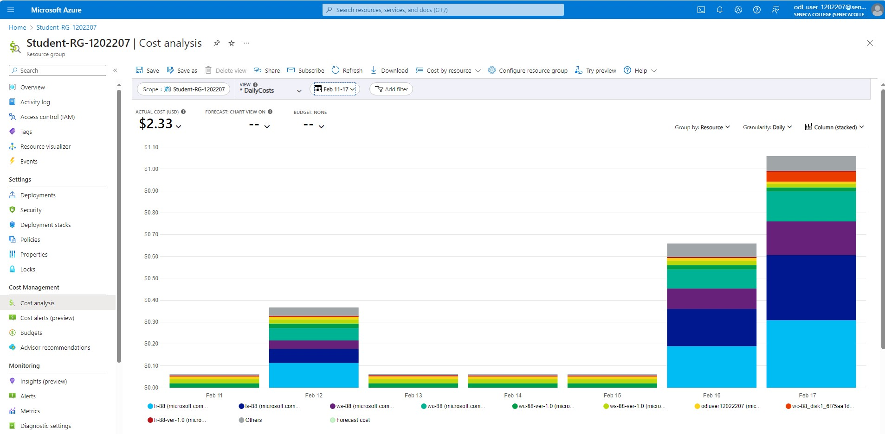
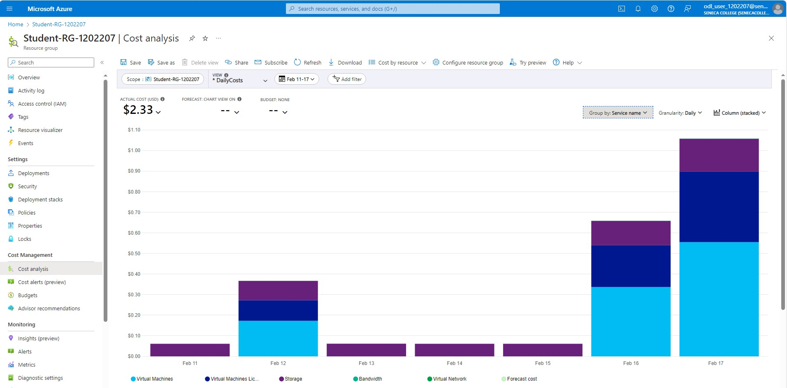
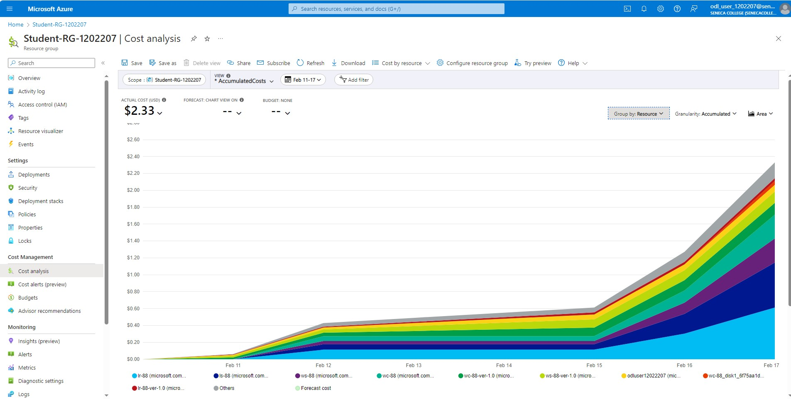
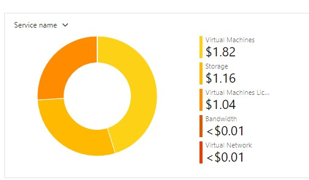
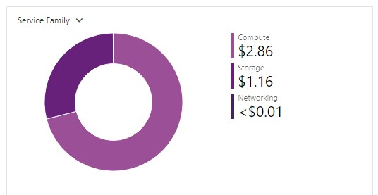
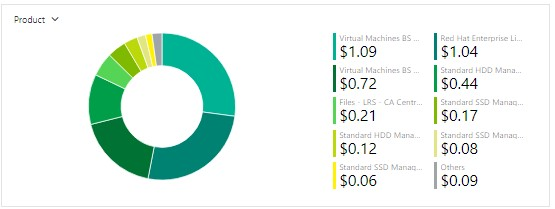
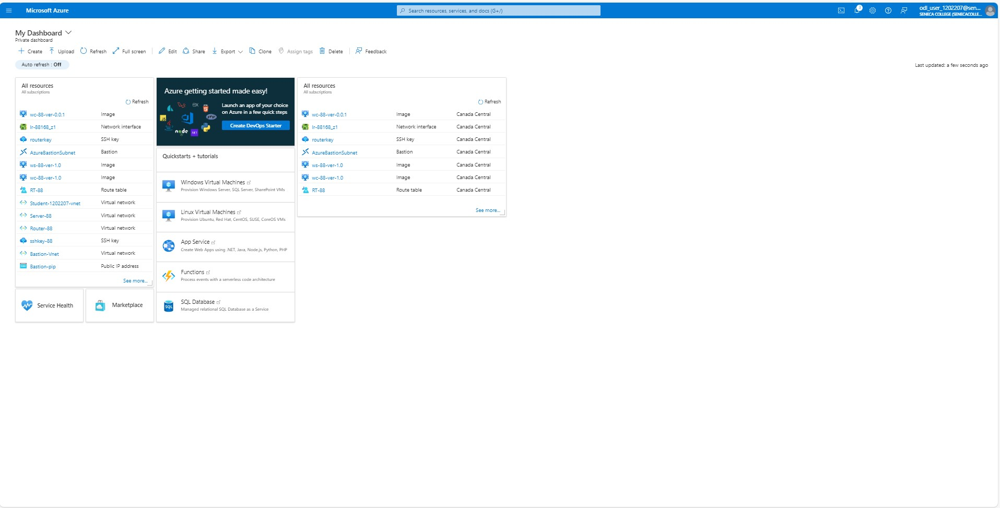

# CAA-900-AzureProject

# Checkpoint5 Submission

- **COURSE INFORMATION: CAA900ZAA**
- **STUDENT’S NAME: Isaiah Cyrus Majam**
- **STUDENT'S NUMBER: 129325239**
- **GITHUB USER_ID: 129325239-mysenecaa**
- **TEACHER’S NAME: Atoosa Nasiri**

## Table of Contents

1. [Part A - Creating & Configuring VMs - Using Portal](#header)
2. [Part B - Enable IP_Forwarding - Using Portal](#header)
3. [Part C - Basic Connectivity - VM Configuration](#header)
4. [Part D - Creating & Configuring VM Images - Using Portal](#header)
5. [Part E - Azure Cost Analysis Charts](#header)
6. [Part F - Create Customized Azure Dashboard](#header)

### [Part A - Creating & Configuring VMs - Using Portal](#header)

1. What is the difference between Windows machine NSG and Linux machine NSG rules? Why? **Do not give screenshots** just describe the difference? Do you need a rule for `ssh` or `rdp`? What happens if you delete specific `ssh` and `rdp` rules?
    <p>&nbsp;&nbsp;
    The difference between the Windows and Linux machine NSGs are the ports they are associated with. For Windows NSG, it is the RDP port which is port 3389 and for Linux NSG it is the SSH port which is port 22. This is done as a standard best practice when doing NSG configurations so that no unnecessary open ports will be used maliciously or incorrectly which helps in controlling and restricting traffic depending on the need.

    &nbsp;&nbsp;We need the rules for `ssh` and `rdp` because we would need to allow inbound traffic to the SSH port 22 or to RDP to port 3389 to enable secure access to the machines and/or to remotely manage machines depending on the need. 

    &nbsp;&nbsp;When we delete `ssh` and `rdp` rules we wont be able to establish SSH and RDP connections to Linux and Windows machines respectively.
    </p>
2. Work from Azure Bash CLI in **Portal** to get a list of your VM, NSG, NIC, and Disks. You can start with the below commands. Make sure the outputs in table format are embedded in your submission.

    `az group list -out table`

    ```bash
    Name                Location       Status   
    ------------------  -------------  ---------
    Bastion_RG          canadacentral  Succeeded
    NetworkWatcherRG    canadacentral  Succeeded
    Student-RG-1202207  canadacentral  Succeeded
    ```

    * create a variable with your student resource group to make your job easier! <br />
    `RG="Student-RG-1202207"`

    * get a list of your VM, NSG, NIC, Disks <br />
    `az vm list -g $RG -o table`

    ```bash
    Name    ResourceGroup       Location       Zones
    ------  ------------------  -------------  -------
    LR-88   Student-RG-1202207  canadacentral  1
    LS-88   Student-RG-1202207  canadacentral  1
    WC-88   Student-RG-1202207  canadacentral  1
    WS-88   Student-RG-1202207  canadacentral  1
    ```


    `az network nic list -g $RG -o table`

    ```bash
    AuxiliaryMode    AuxiliarySku    DisableTcpStateTracking    EnableAcceleratedNetworking    EnableIPForwarding    Location       MacAddress         Name         NicType    Primary    ProvisioningState    ResourceGroup       ResourceGuid                          VnetEncryptionSupported
    ---------------  --------------  -------------------------  -----------------------------  --------------------  -------------  -----------------  -----------  ---------  ---------  -------------------  ------------------  ------------------------------------  -------------------------
    None             None            False                      False                          False                 canadacentral  00-0D-3A-E8-43-83  lr-88439_z1  Standard   True       Succeeded            Student-RG-1202207  8247b324-92eb-4075-8046-d353134fd748  False
    None             None            False                      False                          False                 canadacentral  60-45-BD-5C-59-DE  ls-88829_z1  Standard   True       Succeeded            Student-RG-1202207  4685cc5b-61a3-4ddb-b1ba-94d683e81760  False
    None             None            False                      False                          False                 canadacentral  00-22-48-B0-F9-3E  wc-88791_z1  Standard   True       Succeeded            Student-RG-1202207  1ac50127-64ba-4601-acf1-c346453b1745  False
    None             None            False                      False                          False                 canadacentral  00-22-48-AD-8F-F0  ws-88796_z1  Standard   True       Succeeded            Student-RG-1202207  c2dac78c-dca3-48b5-8e30-0ac6a9d8ff5b  False
    ```


    `az network nsg list -g $RG -o table`

    ```bash
    Location       Name       ProvisioningState    ResourceGroup       ResourceGuid
    -------------  ---------  -------------------  ------------------  ------------------------------------
    canadacentral  LS-88-nsg  Succeeded            Student-RG-1202207  61284cc6-4262-434e-96bc-d66302fba3f3
    canadacentral  WC-88-nsg  Succeeded            Student-RG-1202207  ee1785e1-943e-40f9-a88c-4d5c9aa83eb3
    canadacentral  WS-88-nsg  Succeeded            Student-RG-1202207  511e502d-dfde-46e4-bfe3-768c35b50d79    
    ```


    `az disk list -g $RG -o table`
    
    ```bash
    Name                                             ResourceGroup       Location       Zones    Sku           OsType    SizeGb    ProvisioningState
    -----------------------------------------------  ------------------  -------------  -------  ------------  --------  --------  -------------------
    LR-88_OsDisk_1_6a3252da362e4215ba2ae64359d7cbbf  Student-RG-1202207  canadacentral  1        Standard_LRS  Linux     64        Succeeded
    LS-88_OsDisk_1_dd872ca37b5b4c10bdc39aac055f800d  Student-RG-1202207  canadacentral  1        Standard_LRS  Linux     64        Succeeded
    WC-88_OsDisk_1_8301563364674ee9a4058acc447a3efa  Student-RG-1202207  canadacentral  1        Standard_LRS  Windows   127       Succeeded
    WS-88_OsDisk_1_4213db92346e4cbe84108f377f376196  Student-RG-1202207  canadacentral  1        Standard_LRS  Windows   127       Succeeded
    ```


### [Part B - Enable IP_Forwarding - Using Portal](#header)
1. Check the status of ip-forwarding using the command `az network nic ip-config show` with output format as `json`. Include **only** the command **not output** including the `--query` you used in your submission.

    `az network nic ip-config show --name ipconfig1 --nic-name lr-88168_z1 --resource-group Student-RG-1202207 --output json`

2. When your output format is `json`, which property shows the status of the ip-forwarding attribute? Embed **only** the property that shows the status of ip-forwarding.
    `"enableIPForwarding": true`


3. Check if the IP forwarding in NIC is enabled using Azure bash. 👉 Hint: `az network nic show -g <rg-name> -n <nic-name> --query "enableIpForwarding"`

    `az network nic show -g Student-RG-1202207 -n lr-88168_z1 --query "ipConfigurations[0].enableIpForwarding" --output json`

    MAKE THIS A DROPDOWN
    
    ```json
    {
    "auxiliaryMode": "None",
    "auxiliarySku": "None",
    "disableTcpStateTracking": false,
    "dnsSettings": {
        "appliedDnsServers": [],
        "dnsServers": [],
        "internalDomainNameSuffix": "dlynwnwynytuvljgffilbu3xre.ux.internal.cloudapp.net"
    },
    "enableAcceleratedNetworking": false,
    "enableIPForwarding": true,
    "etag": "W/\"0454a5dc-a6c2-4f93-9d9b-d21cf010cc1b\"",
    "hostedWorkloads": [],
    "id": "/subscriptions/e22a2bd0-d760-4866-9918-1c98f501eb6a/resourceGroups/Student-RG-1202207/providers/Microsoft.Network/networkInterfaces/lr-88168_z1",
    "ipConfigurations": [
        {
        "etag": "W/\"0454a5dc-a6c2-4f93-9d9b-d21cf010cc1b\"",
        "id": "/subscriptions/e22a2bd0-d760-4866-9918-1c98f501eb6a/resourceGroups/Student-RG-1202207/providers/Microsoft.Network/networkInterfaces/lr-88168_z1/ipConfigurations/ipconfig1",
        "name": "ipconfig1",
        "primary": true,
        "privateIPAddress": "192.168.88.36",
        "privateIPAddressVersion": "IPv4",
        "privateIPAllocationMethod": "Dynamic",
        "provisioningState": "Succeeded",
        "resourceGroup": "Student-RG-1202207",
        "subnet": {
            "id": "/subscriptions/e22a2bd0-d760-4866-9918-1c98f501eb6a/resourceGroups/Student-RG-1202207/providers/Microsoft.Network/virtualNetworks/Router-88/subnets/SN1",
            "resourceGroup": "Student-RG-1202207"
        },
        "type": "Microsoft.Network/networkInterfaces/ipConfigurations"
        }
    ],
    "location": "canadacentral",
    "macAddress": "00-22-48-AD-EF-3F",
    "name": "lr-88168_z1",
    "networkSecurityGroup": {
        "id": "/subscriptions/e22a2bd0-d760-4866-9918-1c98f501eb6a/resourceGroups/Student-RG-1202207/providers/Microsoft.Network/networkSecurityGroups/LR-88-nsg",
        "resourceGroup": "Student-RG-1202207"
    },
    "nicType": "Standard",
    "primary": true,
    "provisioningState": "Succeeded",
    "resourceGroup": "Student-RG-1202207",
    "resourceGuid": "4a0592b1-11f6-4f69-a212-bde431d7d1e0",
    "tags": {
        "DeploymentId": "1202207",
        "LaunchId": "37686",
        "LaunchType": "ON_DEMAND_LAB",
        "TemplateId": "7633",
        "TenantId": "353"
    },
    "tapConfigurations": [],
    "type": "Microsoft.Network/networkInterfaces",
    "virtualMachine": {
        "id": "/subscriptions/e22a2bd0-d760-4866-9918-1c98f501eb6a/resourceGroups/Student-RG-1202207/providers/Microsoft.Compute/virtualMachines/LR-88",
        "resourceGroup": "Student-RG-1202207"
    },
    "vnetEncryptionSupported": false
    }
    ```


### [Part C - Basic Connectivity - VM Configuration](#header)

1. In configuring your Linux VMs, for the step "Remove the `firewalld` service", which command will you be using?

    `sudo systemctl disable firewalld`
2. In configuring your Linux VMs, what command do you use to check the status of `iptables`?
    `sudo systemctl status iptables`

3. How can you make iptables service start automatically after reboot on CenOS/RHEL8? 👉 Hint: [RHEL7: How to disable `Firewalld`` and use Iptables instead](https://www.certdepot.net/rhel7-disable-firewalld-use-iptables/)

    `systemctl enable iptables`

4. Run a command in `LR-xx` that shows all `iptables` chains with their order number. What is the default setting? Include both the command and its output in your submission. How could you improve these settings to be less vulnerable to attacks?

    `sudo iptables -nvL --line-numbers` 

    The default setting for INPUT, OUTPUT and FORWARD is set to 'ACCEPT' based on their policy value. To improve these settings to make it less vulnerable to attacks is changing the default policies to 'DROP' instead of 'ACCEPT' and to update the traffic rules from an "Anywhere" value to a specific address and port


5. Run a command that shows the hostname in `LR-XX` and `LS-XX`. Embed the output in your submission.
    
    LR-88 Hostname = `LR-88.CAA900-2241.com`
    LS-88 Hostname = `LS-88.CAA900-2241.com`

### [Part D - Creating & Configuring VM Images - Using Portal](#header)

1. Run a command in CLI that lists all your Custom Images. Hint: `az image list ...`. Change the output format to table format and embed the answer in your submission.

    ```
    HyperVGeneration    Location       Name             ProvisioningState    ResourceGroup
    ------------------  -------------  ---------------  -------------------  ------------------
    V1                  canadacentral  lr-88-ver-0.0.1  Succeeded            STUDENT-RG-1202207
    V2                  canadacentral  lr-88-ver-1.0    Succeeded            STUDENT-RG-1202207
    V1                  canadacentral  ls-88-ver-0.0.1  Succeeded            STUDENT-RG-1202207
    V2                  canadacentral  ls-88-ver-1.0    Succeeded            STUDENT-RG-1202207
    V1                  canadacentral  wc-88-ver-0.0.1  Succeeded            STUDENT-RG-1202207
    V2                  canadacentral  wc-88-ver-1.0    Succeeded            STUDENT-RG-1202207
    V1                  canadacentral  ws-88-ver-0.0.1  Succeeded            STUDENT-RG-1202207
    V1                  canadacentral  ws-88-ver-1.0    Succeeded            STUDENT-RG-1202207    
    ```

2. Delete your VMs after your work is completed. Run a command in CLI that lists all your VMs. Hint: `az vm list ...`. Change the output format to table format and embed the answer in your submission.

   `az vm list --output table`
   
   The output is `null` since all VMs were deleted.

3. Recreate all VMs from your images, and establish basic connectivity. How long the entire process took? How can you do this more efficiently?

    The entire process would talk around 45 mins total to create, setup and establish basic connectivity. This can be done more efficiently by automation the actions in scripts and using CLI commands instead of using the portal.


### [Part E - Azure Cost Analysis Charts](#header)

1. Follow the instructions and create a Cost Analysis table similar to the sample given to you and embed it in your submission. **Do not put it in a separate file, add it to your README.md, but you can keep images in a separate folder. It makes your folder clean and more accessible**


| No. | Scope | Chart Type | VIEW Type |  Date Range | Group By | Granularity| Example |
|-|-|-|-|-|-|-|-|
|1|Student-RG-1202207| Column (Stacked) | DailyCosts | Last 7 Days | Resource | Daily |  |
|2|Student-RG-1202207| Column (Stacked) | DailyCosts | Last 7 Days | Service | Daily |  |
|3|Student-RG-1202207| Area| AccumulatedCosts | Last 7 Days | Resource | Accumulated |  |
|4|Student-RG-1202207| Pie Chart | NA | Last Month | Service Name | NA |  |
|5|Student-RG-1202207| Pie Chart | NA | Last Month | Service Family | NA |  |
|6|Student-RG-1202207| Pie Chart | NA | Last Month | Product | NA |  |

### [Part F - Create Customized Azure Dashboard](#header)


1. Follow the instructions and create a customized Dashboard that contains the minimum above resources in a configuration similar to the sample given to you and embed it in your submission. **Do not put it in a separate file, add it to your README.md, but you can keep images in a separate folder. It makes your folder clean and more accessible**

# Azure Customized Dashboard Sample


