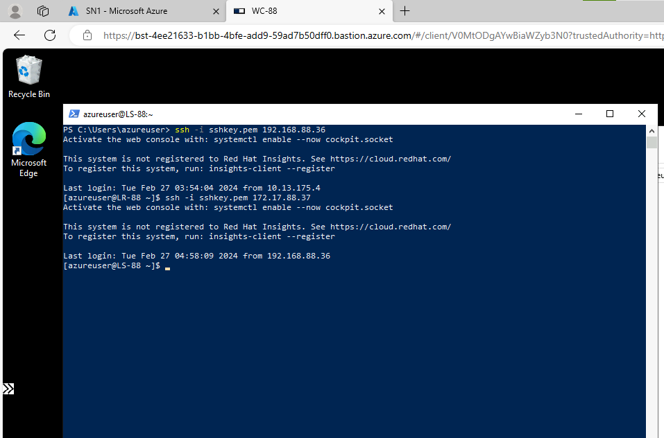
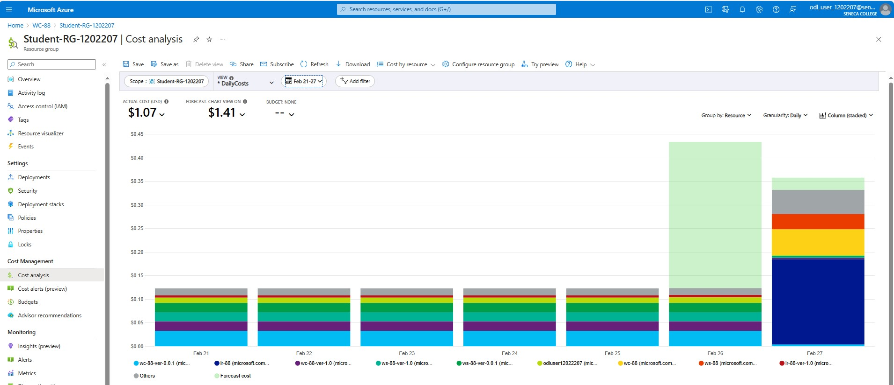
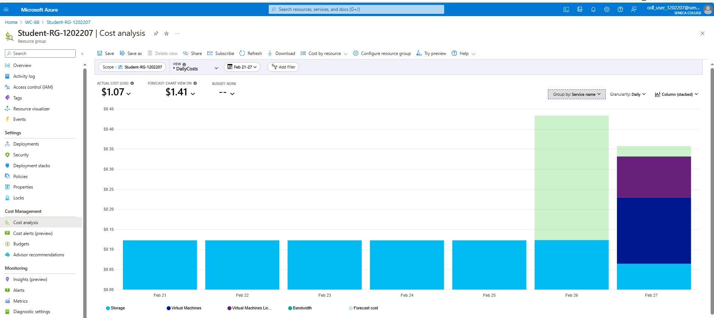
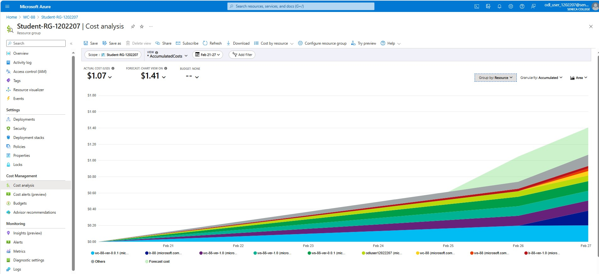
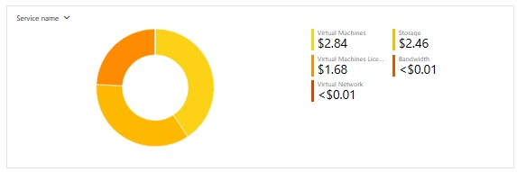
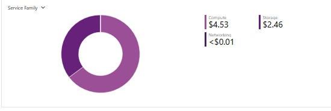
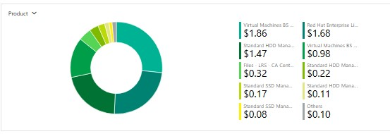

# CAA-900-AzureProject

# Checkpoint6 Submission

- **COURSE INFORMATION: CAA900ZAA**
- **STUDENT’S NAME: Isaiah Cyrus Majam**
- **STUDENT'S NUMBER: 129325239**
- **GITHUB USER_ID: 129325239-mysenecaa**
- **TEACHER’S NAME: Atoosa Nasiri**

## Table of Contents

2. [Part A - Basic Connectivity - Linux VMs Firewall Setting](#part-a---basic-connectivity---linux-vms-firewall-setting)
3. [Part B - Azure Cost Analysis Charts](#part-b---azure-cost-analysis-charts)


### [Part A - Basic Connectivity - Linux VMs Firewall Setting](#part-a---basic-connectivity---linux-vms-firewall-setting)

1. Run a command in `LR-xx` that show `iptables` chains. What is the default setting? How could you improve these settings to be less vulnerable to attacks?

    The command we run here is `iptables -L -v`

    The default settings are INPUT, FORWARD, OUTPUT. We can improve these settings to be less vulnerable to attacks by setting the default policies for each chain to DROP instead of ACCEPT so that if a packet doesn't match any rule in the chain, it will be dropped by default.

2. Run a command that shows the hostname in `LR-88` and `LS-88` and embed the output in your submission.

    The command we run here is `hostname -f`

    ```
    LR-88 Hostname:
    LR-88.CAA900-2241.com
    
    LS-88 Hostname:
    LS-88.CAA900-2241.com
    ```


3. Submit your `lr_iptables.txt` and `ls_iptables.txt` files. **Do not** embed them in your `README.md`, just add it in your folder and give a hyperlink.

    - [lr_iptables.txt](https://github.com/129325239-mysenecaa/CAA-900-AzureProject/blob/main/Checkpoint6/lr_iptables.txt)
    - [ls_iptables.txt](https://github.com/129325239-mysenecaa/CAA-900-AzureProject/blob/main/Checkpoint6/ls_iptables.txt)


4. Test your firewall settings and your configurations for basic `ssh` and `rdp` connectivity between your Desktop Client and Linux Server `LS-xx` and Windows Server `WS-xx` a few times.

    

### [Part B - Azure Cost Analysis Charts](#part-b---azure-cost-analysis-charts)


1. Follow the instructions and create a Cost Analysis table similar to sample given to you and embed it in your submission. **Do not put it in separate file, add it to your README.md, but you can keep images in a separate folder. It makes your folder clean and more accessible**


| No. | Scope | Chart Type | VIEW Type |  Date Range | Group By | Granularity| Example |
|-|-|-|-|-|-|-|-|
|1|Student-RG-1202207| Column (Stacked) | DailyCosts | Last 7 Days | Resource | Daily |  |
|2|Student-RG-1202207| Column (Stacked) | DailyCosts | Last 7 Days | Service | Daily |  |
|3|Student-RG-1202207| Area| AccumulatedCosts | Last 7 Days | Resource | Accumulated |  |
|4|Student-RG-1202207| Pie Chart | NA | Last Month | Service Name | NA |  |
|5|Student-RG-1202207| Pie Chart | NA | Last Month | Service Family | NA |  |
|6|Student-RG-1202207| Pie Chart | NA | Last Month | Product | NA |  |

2. Embed a screenshot of your Customized dashboard after finishing this assignment. It must show there all VMs or disks are deleted.
